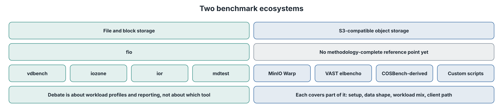
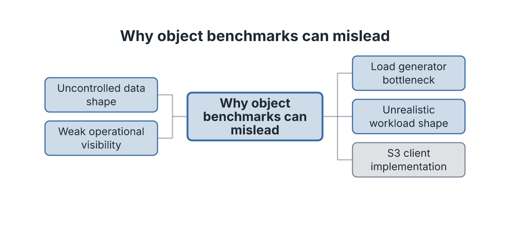
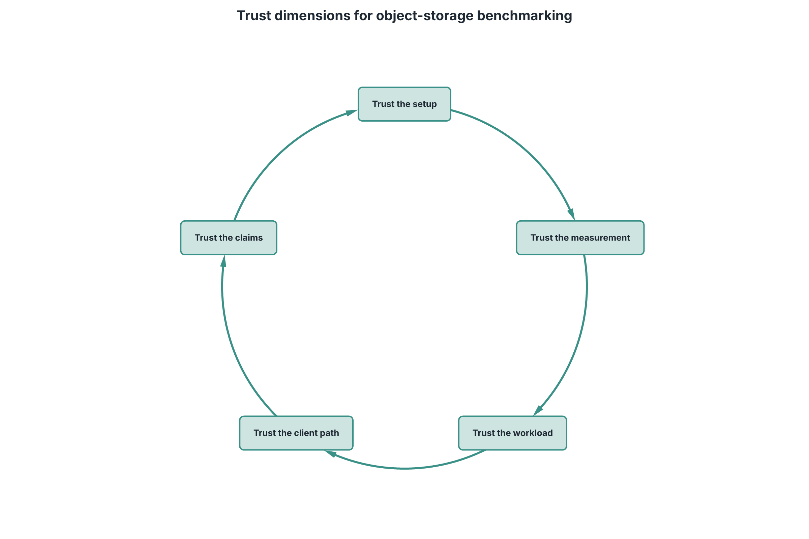
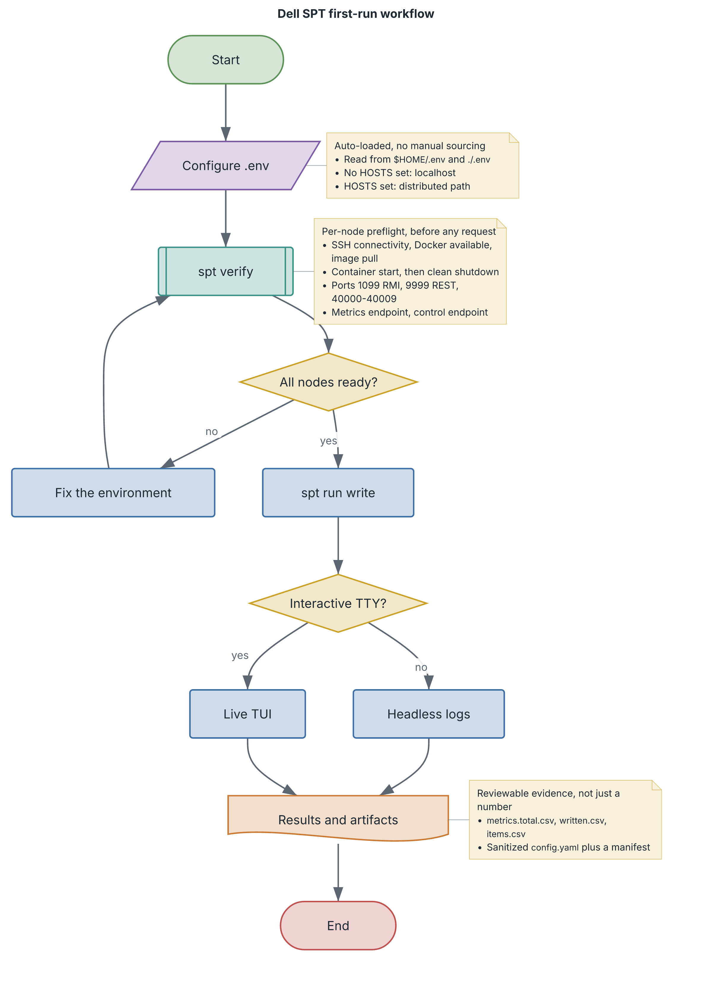
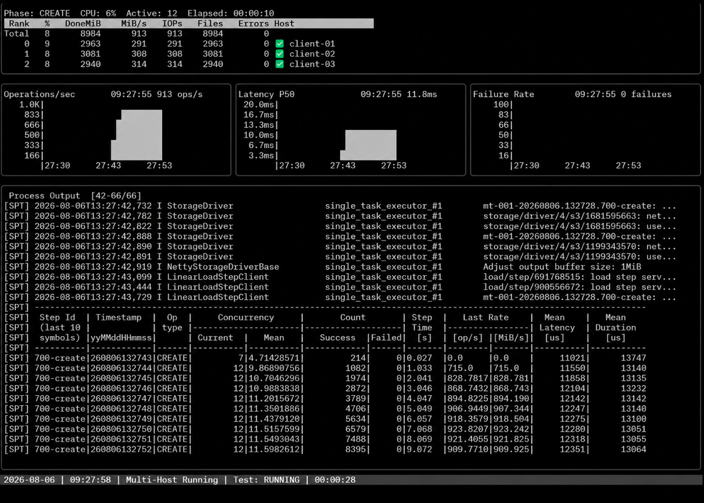

# Object Storage Benchmarking Still Hasn’t Found Its `fio`

*Why S3 performance testing is harder than it looks, and how Dell SPT is designed to make benchmark results easier to trust.*

<!--
PRODUCTION NOTES (remove before publishing)
Channel: Dell InfoHub, Dell SPT technical series, launch article (co-launch with corporate blog)
Source: mcli-poc planning/SPT_InfoHub_Article1_Fio_Final_20260927.md (supersedes the 2026-06-18 draft)
Product facts checked against: storage-performance-tool v5.15.2 (2026-09-21)
Competitor facts checked against: MinIO Warp v1.8.2 (2026-09-23), elbencho v3.2.1 (2026-09-25)
Figures: Figures 1-5 = images/article1-*.png
         Figure 5 is a copy of cli/docs/images/spt-distributed-write-tui.png (sanitized)
         kept separately so it can change independently of the README image. The
         internal 2026-05-26 TUI capture must not be committed to this repo.
Open review items: see the launch review sheet in mcli-poc planning
-->



*Figure 1. File and block storage have a shared reference point. Object storage has capable tools, but not yet a methodology-complete reference point.*

## Object storage has a benchmark trust problem

File and block performance testing have familiar reference points. Practitioners argue about queue depths, block sizes, and reporting, but they rarely argue about which tools belong in the conversation: `fio`, `vdbench`, `iozone`, `ior`, `mdtest`.

Object storage has not converged in the same way.

That is not for lack of importance. S3-compatible object storage now holds AI training data, model checkpoints, analytics tables, backup images, logs, media, and most of the unstructured data enterprises keep for the long term. Teams need to know not only whether an object store can hold the data, but how it behaves under load.

The S3 API makes benchmarking look deceptively simple. Point a client at an endpoint, loop PUTs and GETs, collect throughput and latency, publish a number. Producing the number is easy. Knowing whether to believe it is not.

Was the load generator the bottleneck? Did one client in a distributed run underperform? Did the test data quietly engage compression or deduplication? Did the average hide the tail? Did the client implementation shape the result? Could someone else repeat the run next month and get the same answer?

That is what we mean when we say object storage still hasn’t found its `fio`.

The claim needs care. MinIO Warp is widely used and is a practical default for many S3 practitioners: it is fast, approachable, and well known. elbencho is respected for its breadth across file, block, and object testing. Many organizations also rely on COSBench-derived workflows and internal scripts. These are capable tools, and they are improving quickly. In recent releases Warp has added S3-over-RDMA builds and a consistency benchmark, and elbencho has added journaled data verification and higher-resolution latency histograms.

That activity supports the point. The field is converging on what a trustworthy object benchmark has to cover, but no single tool has yet become the shared, methodology-complete reference point that `fio` became for block and file. That reference point needs more than fast request loops. It also needs setup validation, workload realism, data-shape control, client-path transparency, observability, and reproducibility.

This article asks a practical question: if object storage eventually gets its `fio`, what will that tool need to do? Then it shows where Dell Storage Performance Tool (Dell SPT) fits.

## Why object benchmarks mislead



*Figure 2. Four common ways object benchmarks mislead, plus one factor that shapes all of them: the S3 client implementation.*

Object benchmarks usually go wrong in ordinary ways that are easy to miss.

### 1. The load generator becomes the bottleneck

Modern object stores can absorb enormous request concurrency, particularly with small objects. If the benchmark client saturates first, the result describes the client host, its runtime, its HTTP stack, or its network path, not the storage target.

Throughput alone cannot tell you which happened. A credible result also accounts for what it cost to generate: client CPU and memory, throughput per client core, and run-to-run variance.

### 2. Uncontrolled data shape changes the storage path

Enterprise object stores use compression, deduplication, caching, and tiering. Those features are valuable, and they also mean the payload is part of the experiment.

Highly compressible data exercises a different storage path from incompressible data. Repeated content can trigger deduplication. An uncontrolled working set can turn a disk test into a cache test. If the benchmark does not control data shape, the storage system decides which optimizations engage.

### 3. Unrealistic workload shape

Production object workloads rarely run one operation forever. Applications mix reads, writes, deletes, metadata lookups, and listings, and they combine small and large objects, multipart uploads, and range reads. Backup writes and then verifies. Analytics lists, decides, and reads. AI pipelines stream large training objects, write checkpoints, and issue metadata-heavy requests along the way.

A pure PUT loop or GET loop is useful. It is one slice of the problem.

### 4. Weak operational visibility

Distributed benchmarks also fail for ordinary operational reasons. SSH is misconfigured, Docker is unavailable on one node, a port is blocked, a stale container holds a required port, or one client has a slow network path or a noisy neighbor. Aggregate throughput hides all of this until the run is already invalid.

The setup is part of the result. A benchmark should catch setup problems before the first request, and make anomalies visible while the run is still going.

### And throughout: the S3 client implementation

S3 is an API, but the client that speaks it matters. A custom HTTP client and a standard SDK can differ in connection management, request signing, retry behavior, and TLS negotiation, and accelerated data paths such as S3-over-RDMA change the picture again. None of those differences makes one result “wrong,” but a reviewer should be able to tell whether they are looking at storage behavior, workload behavior, or client behavior.

## Industry momentum around object-storage testing

The broader ecosystem is already working toward shared testing practice. The [SNIA Cloud Object Storage Test Tools Technical Work Group](https://www.snia.org/testtoolstwg) focuses on multi-vendor interoperability and API compatibility testing for cloud object storage, including S3-compatible implementations. S3-compatible services are widely deployed, yet behavior still varies across implementations, clients, and edge cases.

Compatibility testing and performance testing answer different questions. Compatibility testing asks whether client and service agree on API behavior. Performance testing asks how the system behaves under load, at scale, and across workload shapes. Both need repeatable, transparent, multi-vendor-aware methods.

Dell participates in industry efforts around object-storage interoperability, including SNIA Cloud Object Storage Plugfest and related test-tool work. Dell SPT applies the same philosophy to the adjacent problem of performance benchmarking: make the workflow open, inspectable, and repeatable. This is not a claim that SNIA endorses Dell SPT or that Dell SPT is an industry standard.

## What a trustworthy object benchmark should do



*Figure 3. Five questions a trustworthy object-storage benchmark should help answer.*

If object storage eventually gets its `fio`, that tool will need to help teams answer five questions.

**Can I trust the setup?** The tool should catch common environment problems before the run starts. In distributed tests, it should confirm that hosts are reachable, runtimes are available, ports are usable, and every client is running the same build.

**Can I trust the measurement?** One throughput number is not enough. The tool should report latency percentiles, time to first byte where it is meaningful, failure rates, and the artifacts needed to review the run later. It should also be honest about units and about what it did not measure.

**Can I trust the workload?** The tool should go beyond single-operation loops to mixed operations, large objects and multipart behavior, range reads, reusable object sets, and explicit control over the data it writes. It should also be able to confirm that the data came back intact.

**Can I trust the client path?** The tool should make it clear which S3 client implementation is being exercised, and let users change it to cross-check a result.

**Can I trust the claims?** The methodology should be explicit. Comparative claims should use identical targets, documented tuning, repeated runs, and full result publication, including cases where another tool wins.

Dell SPT is designed to meet this bar.

## Where Dell SPT fits

Dell SPT is Dell’s open-source, MIT-licensed benchmark for S3-compatible object storage. It pairs a Go command-line interface and terminal UI (TUI) with a Java benchmark engine that the CLI runs in managed Docker containers. The engine is a modernized descendant of EMC Mongoose, which Dell and EMC performance engineering used for enterprise object-storage testing for years. SPT keeps that engine’s workload modeling and distributed execution, and wraps them in a task-oriented workflow: configure, verify, run, observe, collect.



*Figure 4. A typical first SPT workflow: configure defaults in `.env`, validate every node with `spt verify`, launch a workload, watch it live or run it headless, and keep the results bundle.*

A first pass looks like this, with endpoint, credentials, and bucket read automatically from a `.env` file:

```bash
spt verify

spt run write \
  --prefix spt-quickstart/write/ \
  --duration 2m \
  --threads 8 \
  --object-size 1MiB
```

These settings are not a recommendation. The example shows that a run starts from a small, repeatable command rather than a pile of lab-specific scripts. The rest of this section maps SPT to the five questions above.

### Trust the setup

`spt verify` makes preflight checks a normal part of the workflow. With no hosts configured, it checks the local Docker environment. With a `HOSTS=` list in `.env`, it checks every node before any S3 request is sent: SSH connectivity, Docker availability, engine image pull, container start and clean shutdown, required control and metrics ports, and RDMA readiness where RDMA is in use.

SPT also pins the engine build. Each CLI release runs its matching, version-tagged engine image and never falls back silently to `latest`. Before a run starts, SPT checks that every participating engine reports the same build and rejects known mismatches by default. The build identity is written into the results bundle, so a result records exactly which engine produced it.

### Trust the measurement



*Figure 5. The SPT TUI during a multi-host run: cluster-wide progress, live throughput and latency, and a per-client table that makes an underperforming node visible before its numbers disappear into the aggregate.*

In an interactive terminal, SPT shows live throughput, latency, failures, and per-client detail. A slow client that aggregate throughput would hide shows up in the per-client view. Without a TTY, or with `--headless`, the same command produces automation-friendly logs for CI and unattended runs.

SPT reports p50, p90, p99, and p99.9 latency. It tracks time to first byte for body-returning reads and listings, and reports it only when samples exist, so a missing value is not shown as zero. Mixed workloads report each operation type separately rather than averaging GETs and DELETEs together. Bandwidth uses IEC units (`MiB/s`) because the values are 1024-based. Each run leaves a results bundle with metrics, sanitized configuration, object lists, and engine build information for later review.

### Trust the workload

SPT supports write, read, list, delete, mixed, and mock workloads. Mixed mode issues GET, PUT, DELETE, and STAT requests concurrently with configurable weights, which moves testing closer to production behavior.

For large objects, SPT exposes multipart part size and object- and part-level concurrency, along with request checksums including CRC32C, SHA-256, and CRC64-NVME. Reads can target fixed or random byte ranges. A write run can save its object list so that later read runs reuse the same data set with different concurrency, drivers, or network settings. `spt replay` can re-run archived SPT or legacy Mongoose benchmark workloads against a new target. These are archived benchmark definitions, not captured production traffic.

SPT also treats data shape as a benchmark input. Generated data can be set to a target compressibility, and anti-dedupe stamping keeps inline deduplication from dominating typical full-object writes. Teams can then test storage-efficiency behavior on purpose instead of by accident.

For correctness as well as speed, `write-verify` stores a SHA-256 digest with each object, and `read-verify` later confirms that every byte comes back as written. Resumable manifests and a dedicated exit code for detected corruption make these checks usable in automation. They are correctness tests, not performance benchmarks.

### Trust the client path

SPT can run the same workload through three S3 drivers, selected at run time with `--s3-driver`: SPT’s default asynchronous Netty client, the AWS SDK for Java v2, and an optional RDMA data path for compatible Linux clients and storage targets. If a result is surprising, running it through a different client path is a direct way to separate storage behavior from client behavior. Driver support differs by feature, and the documentation lists which features each driver supports.

S3-over-RDMA is under active development across the industry, including in SNIA’s Accelerated Object I/O work. SPT’s RDMA path is for exercising and validating that data path on supported hardware, not a blanket claim that RDMA is faster. We will cover it in a dedicated article. SPT can also negotiate post-quantum TLS on supported HTTPS paths through the Netty driver.

### Trust the claims

SPT is open source so that anyone can inspect how it generates load, how it measures, and where its limits are. The same principle applies to performance claims. When we publish comparative results, they will come with documented configurations, repeated runs, client-side CPU and memory data, and the full result grid, including cases where another tool wins.

## What this article is not claiming

Dell SPT is not the `fio` of object storage. A reference tool earns that status over time, through adoption and scrutiny. SPT is Dell’s open-source contribution to better object-storage benchmarking practice. This article also makes no claim that SPT is faster than other tools. That claim needs data, and the data will be published in full.

## What comes next

This article set out the problem and the criteria. Upcoming articles in this series will go deeper:

- **Meet Dell SPT: Modern Object Storage Benchmarking Made Easier.** The architecture, the first-run workflow, the TUI, and the distributed model.
- **Trustworthy Benchmarks Start Before the First PUT.** Environment validation, build consistency, and distributed-run readiness.
- **Beyond Averages: Latency Percentiles and TTFB.** What throughput alone hides.
- **Real Workloads Are Mixed Workloads.** GET, PUT, DELETE, and STAT together.
- **Data Shape Matters.** Compressibility, deduplication, checksums, and integrity verification.

Object storage may not have its `fio` yet, but the criteria are clear. A trustworthy object benchmark makes setup, measurement, workload shape, client behavior, and claims easy to inspect and reproduce.

To try Dell SPT, download the latest release from [GitHub](https://github.com/dell/storage-performance-tool/releases), run `spt verify`, and start with a small workload. Issues, discussion, and contributions are welcome at [github.com/dell/storage-performance-tool](https://github.com/dell/storage-performance-tool).
